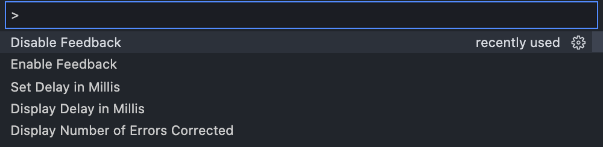
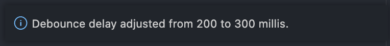
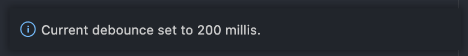
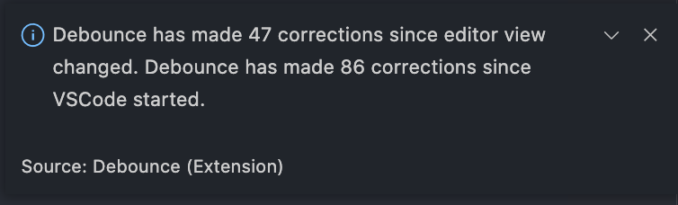

# Debounce

Debounce is an *easy-to-use, adjustable* accessibility extension for users with hand tremors.

Simple in principle, simple in implementation. **Let's make VSCode more accessible!**

Please, feel free to request features by emailing me at [rebel@TheDeviantRebel.com](mailto:rebel@TheDeviantRebel.com)

## Features

> Tip: All features are available in commands.

To set a new delay value, run the '*Set Delay in Millis*' command.

To display the current becouncing delay value, run the '*Display Delay in Millis*' command.

To display the number of error corrections made since you last switched editor views, and session lifetime totals, run the '*Display Number of Errors Corrected*' command.

## Requirements

Debounce runs as-is with no dependencies.

## Extension Settings

Settings are only adjusted via commands.

## Known Issues

Debounce has no known issues as of yet.

## Release Notes

Initial release. Until now I have only used it for myself. Please, feel free to request features by emailing me at [rebel@TheDeviantRebel.com](mailto:rebel@TheDeviantRebel.com)

### 1.0.0

Initial release.

-----------------------------------------------------------------------------------------------------------

Would you like to make a **donation**? lol no thanks.

**Enjoy!**
